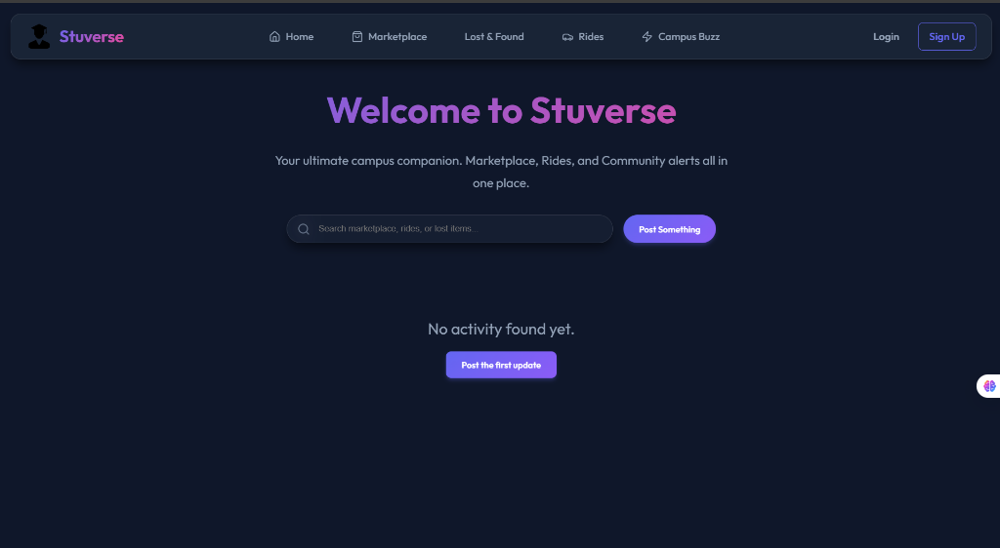
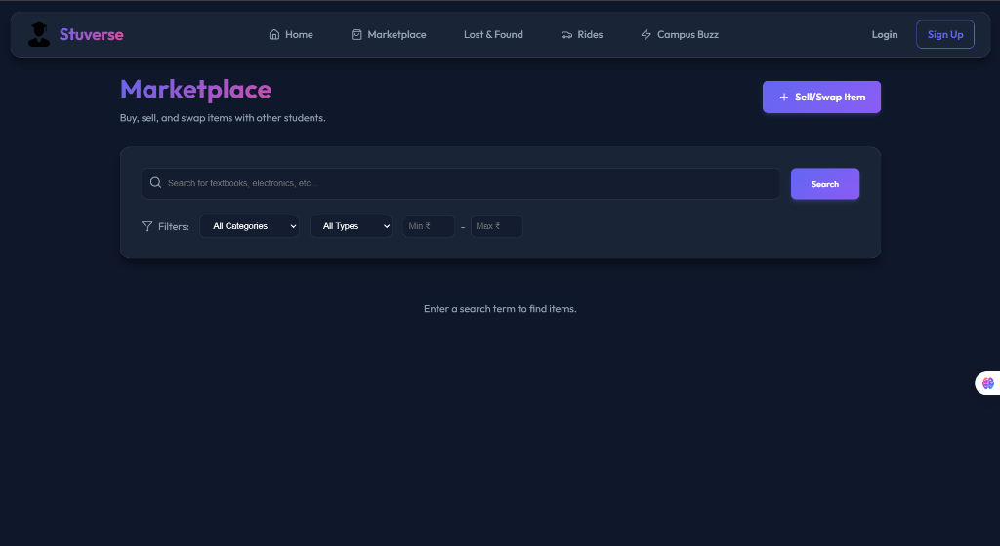
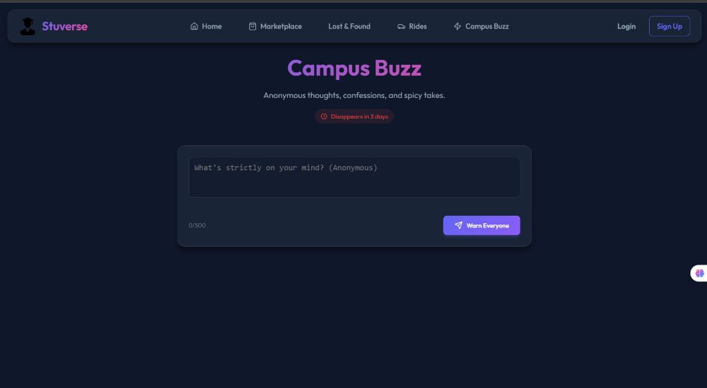
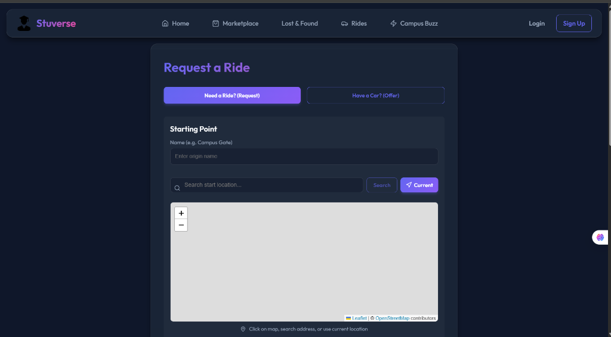
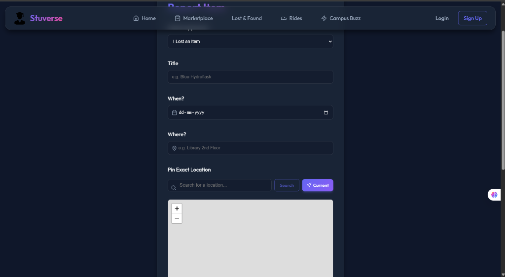

# Stuverse 🎓

**Stuverse** is a specialized campus community platform designed to serve as a central hub for university students. Built using the **MERN stack** (MongoDB, Express, React, Node.js), it focuses on fostering interaction and mutual aid within a specific university ecosystem.

## 🚀 Overview

The standout feature of Stuverse is **University Isolation**. Every user is tied to their specific campus, ensuring that the marketplace, ride-shares, and social feeds they see are 100% relevant to their local student community.

## 📸 Screenshots

### Home Dashboard


### Campus Marketplace


### Campus Buzz (Social Feed)


### Ride Sharing


### Lost & Found


---

## ✨ Key Features

*   🛒 **Campus Marketplace:** A secure space for students to buy and sell items like textbooks, electronics, and dorm furniture directly to their peers.
*   🚗 **Ride-Sharing:** A carpooling system where students can find or offer rides to common destinations (airports, hometowns, or campus events).
*   🔍 **Lost & Found:** A dedicated board to help recover lost items within campus grounds efficiently.
*   📣 **Buzz (Social Feed):** A forum for campus news, events, and anonymous "confessions," keeping students informed and engaged.
*   💬 **Real-Time Coordination:** Integrated instant messaging (via **Socket.io**) allows users to negotiate deals or coordinate rides without leaving the platform.
*   🔔 **Instant Notifications:** Keeps users updated on new messages, ride requests, or activity on their listings.

---

## 🛠️ Tech Stack

- **Frontend:** React, Vite, Tailwind CSS, React Router
- **Backend:** Node.js, Express.js
- **Database:** MongoDB (Atlas)
- **Real-time:** Socket.io
- **Authentication:** Passport.js (Google & Microsoft OAuth)
- **File Storage:** Cloudinary

---

## ⚙️ Installation & Setup

### Prerequisites
- Node.js installed
- MongoDB URI
- Cloudinary Credentials
- Google/Microsoft OAuth Credentials

### Steps

1. **Clone the Repository**
   ```bash
   git clone https://github.com/gouthamx67/Stuverse.git
   cd Stuverse
   ```

2. **Server Setup**
   ```bash
   cd server
   npm install
   ```
   Create a `.env` file in the `server` directory and add:
   ```env
   PORT=5000
   MONGO_URI=your_mongodb_uri
   JWT_SECRET=your_jwt_secret
   CLIENT_URL=http://localhost:5173
   CLOUDINARY_CLOUD_NAME=your_name
   CLOUDINARY_API_KEY=your_key
   CLOUDINARY_API_SECRET=your_secret
   ```

3. **Client Setup**
   ```bash
   cd ../client
   npm install
   ```

4. **Run the Application**
   - In `server` directory: `npm run dev`
   - In `client` directory: `npm run dev`

---

## 🤝 Contributing

Contributions are welcome! Please feel free to submit a Pull Request.

## 📄 License

This project is licensed under the MIT License.
